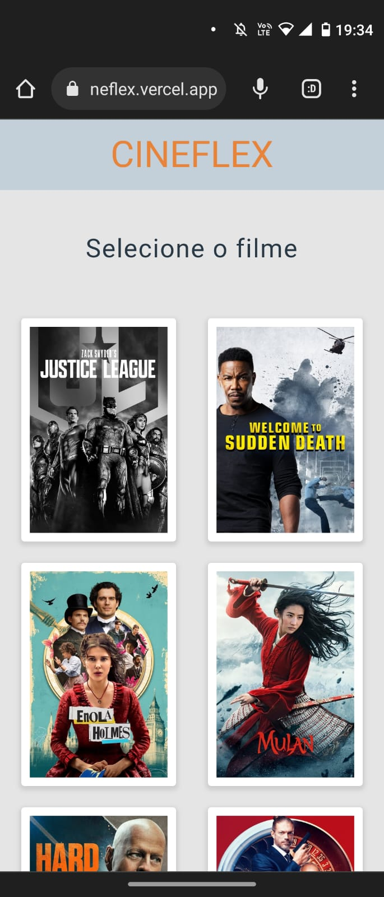
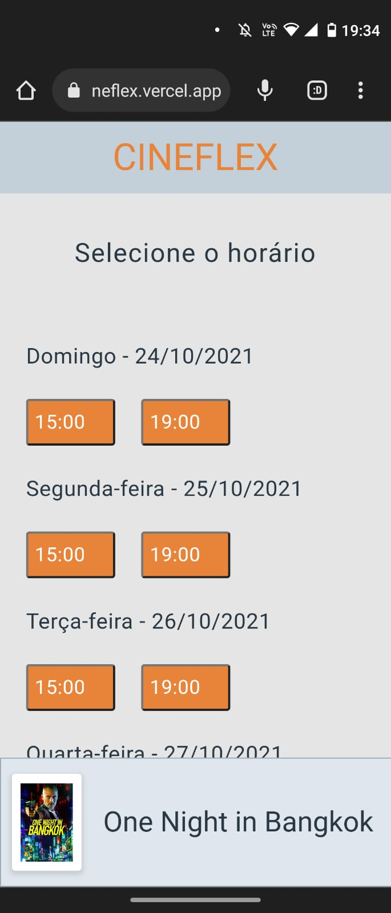
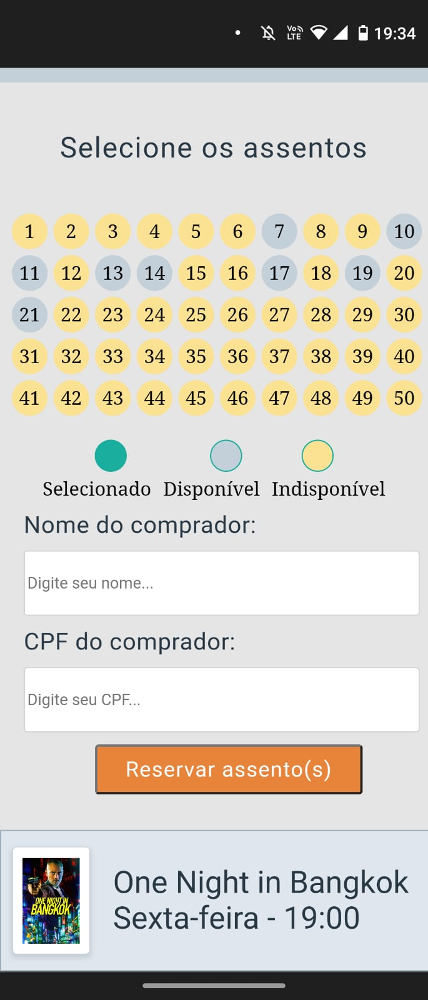
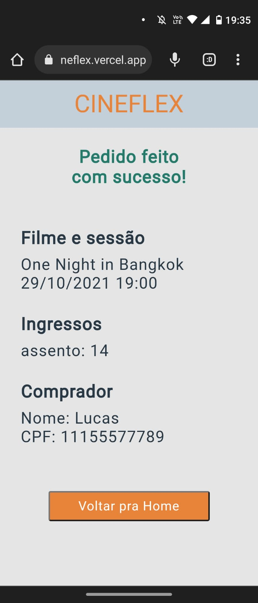

# Cineflex
Este projeto consiste em uma Single-Page Application (SPA) para um cinema, que foi desenvolvida usando React Router. A aplicação permite que os usuários visualizem os filmes em exibição. Além disso, os usuários podem realizar a compra de ingressos através da aplicação, selecionando o filme desejado e escolhendo a poltrona no cinema. O React Router é utilizado para criar as rotas da aplicação, permitindo que os usuários naveguem entre as diferentes páginas sem a necessidade de recarregar a página inteira. Com isso, é possível oferecer uma experiência de usuário mais fluida e agradável.

link da vercel https://projeto-10-cineflex.vercel.app/







## Como rodar o projeto

1. Clone esse repositório 

2. Instalar as dependências 


```
npm install
```

Rode o projeto

```
npm start
```


